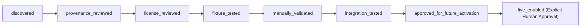

# MarketOS External Capability Adoption Map

> [!NOTE]
> The machine-readable backing catalog for this adoption map is located at `data/external_capability_catalog.json`.
> A machine validation contract is enforced by `scripts/ai/validate_external_capability_catalog.py` and tested via `tests/contracts/test_external_capability_catalog.py`.
> Bounded source dossiers for every evaluated candidate repository are located in `docs/ai/source_dossiers/`.

## Strategic Objective

MarketOS requires external capability leverage to accelerate product research, scouting, intelligence, and commerce operations without accumulating:
1. **Duplicate runtimes or parallel orchestrators** (no duplicate event spines, queue engines, or workflow schedulers).
2. **Licensing contagion or legal risk** (strict rejection of viral copyleft such as AGPL-3.0 and non-OSI restrictive licenses).
3. **Unpinned remote dependencies or supply chain vulnerability** (all remote sources must be pinned to full 40-character commit hashes).
4. **Unverifiable vendor claims or live mutation authority** (offline-by-default, dry-run fixtures, and TrustOS/Approval Ledger gates).

---

## Architectural Pinning Model (xAI / Grok Reference Architecture)

MarketOS adapts the official xAI/Grok plugin marketplace pinning model:
- **Full Commit SHA Pinning**: Every external repository candidate evaluated for adoption must be pinned to an immutable 40-character commit hash (`commit_sha`) and specific release tag (`pinned_release`). Moving branches (`main`, `master`, `HEAD`) or unpinned tags are rejected by the adoption validator.
- **Contract-First Seam Isolation**: External capabilities are never imported directly into business logic. They are placed behind thin, typed interfaces (e.g., `backend.scouting.crawl4ai_client`, `backend.commerce.medusa_adapter`).
- **No Unreviewed Plugins**: External plugin codes are never downloaded or executed dynamically. Only reviewed, pinned, and tested patterns are admitted.

---

## Typed Capability Adoption Lifecycle

Every external capability transitions through an explicit, machine-validated 8-stage lifecycle:

1. **`discovered`**: Candidate identified, repository URL and initial use case recorded.
2. **`provenance_reviewed`**: Maintainer identity, upstream repository hygiene, release cadence, and full 40-char commit SHA confirmed.
3. **`license_reviewed`**: SPDX license identified, attribution obligations documented, copyleft and commercial restrictions evaluated.
4. **`fixture_tested`**: Capability exercised against offline static fixtures; mock inputs/outputs verified.
5. **`manually_validated`**: Operator verified behavioral bounds in a dry-run environment.
6. **`integration_tested`**: Seam adapter tested with adjacent MarketOS subsystem contracts.
7. **`approved_for_future_activation`**: Passed TrustOS policy gate; marked ready for potential live use once credentials and budget are allocated.
8. **`live_enabled`**: Live external network/API execution enabled **only after explicit human approval** in the Approval Ledger.

*Metadata Rule: Marking a capability as `live_enabled` in planning records never implies that live external execution occurred.*

---

## Evaluated Public Repository Candidates (19 Candidates)

| Candidate | Pinned Commit / Release | License | Intended MarketOS Seam | Decision | Classification | Rationale & Architectural Seam |
|---|---|---|---|---|---|---|
| **Crawl4AI** | `b04ed9f3a941a96509272f3bc14be85f5767736a` (v0.4.2) | Apache-2.0 | `backend.scouting.crawl4ai_client` | **Integrate** | Wrapped | Canonical web content extraction engine; narrow client wrapper; headless browser execution gated behind offline fixtures. |
| **Scrapy** | `8c85937adef8279f12e35e0ee9a20c52ff6d1648` (2.12.0) | BSD-3-Clause | `backend.scouting.item_pipeline` | **Emulate** | Studied | Emulate CSS/XPath selector and Item validation pipeline patterns; reject Twisted event loop to preserve single asyncio spine. |
| **dlt** | `5a608086b7f7c6735968911138cb449472f7a259` (1.7.0) | Apache-2.0 | `data.ingestion.schema_normalizer` | **Adapt** | Studied / Adapt | Evaluate schema inference and staging pipeline; do not add dependency until compatibility proof and concrete need exist. |
| **DuckDB** | `19864453f7d0ed095256d848b46e7b8630989bac` (v1.1.3) | MIT | `backend.analytics.embedded_query_engine` | **Adapt** | Studied / Adapt | In-process analytical SQL querying over parquet/jsonl evidence fixtures; zero-server local analytics. |
| **Polars** | `87feed72585eff5acf3defb7f81029123d5cba68` (py-1.17.1) | MIT | `backend.analytics.dataframe_engine` | **Emulate** | Studied | Reference tabular query expression syntax; rely on native structures until data volumes demand Rust extension. |
| **OpenLineage** | `e7a768ffef28b2dd011e2376d4c63267316b6584` (1.28.0) | Apache-2.0 | `backend.observability.lineage_facets` | **Emulate** | Studied | Adopt OpenLineage Run/Dataset/Job facet schema patterns for evidence traceability; reject heavy runtime client. |
| **Open Policy Agent** | `b2c26708e9d55645d7f837db495031f7e4152594` (v1.20.2) | Apache-2.0 | `evaluation.trustos.policy_gate` | **Emulate** | Studied | Emulate declarative policy grammar in native Python; reject running external Go daemon sidecar. |
| **Great Expectations** | `883fd69e62d44fde0db8c61e300305a4f678b87f` (1.3.0) | Apache-2.0 | `evaluation.quality` | **Emulate** | Studied | Emulate expectation assertion DSL for fixture contracts; consolidated into canonical evaluation.quality. |
| **OpenTelemetry Python** | `74509a111acd486d195ec5ea8478c8ccbf1f93c1` (v1.31.1) | Apache-2.0 | `backend.observability.tracing` | **Adapt** | Wrapped | Adopt OTel-compatible trace context and span data models; keep network exporters disabled/offline by default. |
| **Chatwoot** | `9f920b549c14491a4e587687a3eed5d21c6ccc7d` (v4.18.0) | AGPL-3.0 | `backend.messaging.chatwoot_boundary` | **Reject** | Studied | **CRITICAL AGPL-3.0 COPYLEFT RISK**: strictly prohibited from in-tree vendoring or library linking. Isolated external HTTP webhooks only. |
| **Medusa** | `956a50e934fb0db6f55d5b9fa459a43abcee358b` (v2.4.0) | MIT | `backend.commerce.medusa_adapter` | **Adapt** | Studied / Adapt | Adapt product import/export JSON payload schema; keep output at `status: draft`; do not import Node.js server. |
| **Saleor** | `a2a04538ed9e64bfee844179e672645d4fd3f6a5` (3.20.91) | BSD-3-Clause | `backend.commerce.saleor_adapter` | **Adapt** | Studied / Adapt | Adapt product attribute & multi-channel pricing schema; do not embed Django core into MarketOS. |
| **Temporal** | `b16215104069f798b79592679d8a16dd3d702883` (1.8.0) | BSL-1.1 / MIT | `backend.observability.replay` | **Reject** | Studied | **REJECT ORCHESTRATOR DUPLICATION**: non-permissive BSL-1.1 server; duplicates MarketOS native event spine. Emulate activity replay metadata only. |
| **Prefect** | `c8986edebb2dde3e2a931adbe24d2eaefcb799cb` (3.2.0) | Apache-2.0 | `backend.execution.task_states` | **Reject** | Studied | **REJECT ORCHESTRATOR DUPLICATION**: heavy workflow engine duplicates MarketOS single event spine. Emulate task transition states only. |
| **Dagster** | `21db4e55d3d1b723be3fdd90690fb9ca638744ac` (1.9.10) | Apache-2.0 | `backend.observability.lineage_facets` | **Emulate** | Studied | Emulate software-defined asset (SDA) lineage and materialization records; reject heavy Dagit/daemon runtime. |
| **Airbyte** | `2fa9e2ec2098ef2e400d7e39fd1db4200209c628` (v0.64.4) | ELv2 / BSL | `data.ingestion.connectors` | **Reject** | Studied | Non-permissive license (ELv2/BSL) + heavy Docker/Java container orchestrator. Duplicates MarketOS singular architecture. |
| **n8n** | `0e26f58ae66c2aaad05af24fd56c28c960bcdd9b` (n8n@1.71.0) | Sustainable Use | `backend.automation.n8n_boundary` | **Reject** | Studied | Non-permissive commercial restriction + visual DAG engine. Duplicates MarketOS single native event spine. |
| **Firecrawl** | `2a71f0190a02544f1ae06f0e1ce0c050cc4fe36a` (v2.11.359) | AGPL-3.0 | `backend.scouting.firecrawl_boundary` | **Reject** | Studied | **AGPL-3.0 COPYLEFT**: reject runtime and vendoring. Crawl4AI is already the canonical permissive extraction engine. |
| **Vendure** | `b3d79ebfe5fa490b025e9004badad2fe0fe08df2` (v3.3.7) | MIT | `backend.commerce.vendure_adapter` | **Adapt** | Studied / Adapt | Adapt product option/facet taxonomy; generate draft blueprints only; do not import NestJS runtime. |

---

## Detailed Evaluation: Concrete Implementation Targets

### 1. Web Content Extraction: Crawl4AI (Selected) vs. Scrapy (Emulate) vs. Firecrawl (Rejected)
- **Why Crawl4AI was chosen for narrow integration**: Permissive Apache-2.0 license, modern async/await Python native client, and high-quality markdown extraction tailored for LLM reasoning. Headless browser execution is guarded by `scouting_mode="offline_fixture"` by default.
- **Why Scrapy is emulated only**: Scrapy's Twisted reactor creates severe architectural collisions with MarketOS's native `asyncio` loop. Its item validation pipeline concept is adopted in pure Python.
- **Why Firecrawl is rejected**: AGPL-3.0 copyleft creates severe licensing contagion. Furthermore, its heavy BullMQ/Redis architecture would introduce an unwanted second orchestration daemon.

### 2. Ingestion & Staging: dlt Evaluation
- **Evaluation**: `dlt` provides clean declarative schema evolution and destination normalization.
- **Decision**: **Adapt schema patterns only**. Do not add `dlt` to `pyproject.toml` at this phase. Adding `dlt` brings dependencies (PyArrow, GitPython, DuckDB) that must be proven compatible with the active dev stack and Windows runners before being merged. Native Pydantic normalization remains the active authority.

### 3. Commerce Blueprints: Medusa, Saleor, Vendure
- All three platforms provide mature e-commerce product schemas.
- **Enforced Rule**: MarketOS generates platform-neutral draft blueprints. Blueprints are strictly emitted with `status: draft`. Zero storefront publication authority or inventory mutation is granted to this layer.

---

## Machine Enforcement Gates

The adoption validator (`scripts/ai/validate_external_capability_catalog.py`) deterministically halts integration if:
1. Any repository candidate is unpinned or provides a malformed commit SHA.
2. An AGPL-3.0 or non-permissive licensed project claims `integration_mode: integrate` or `vendor_wrap_study: wrapped`.
3. A record contains credential-shaped tokens, keys, or passwords.
4. A capability claims live network execution without an explicit TrustOS gate and Approval Ledger clearance.
5. A capability is missing a rollback deactivation strategy.
6. A candidate is marked `approved_for_future_activation` before passing all prerequisite review and test stages.
